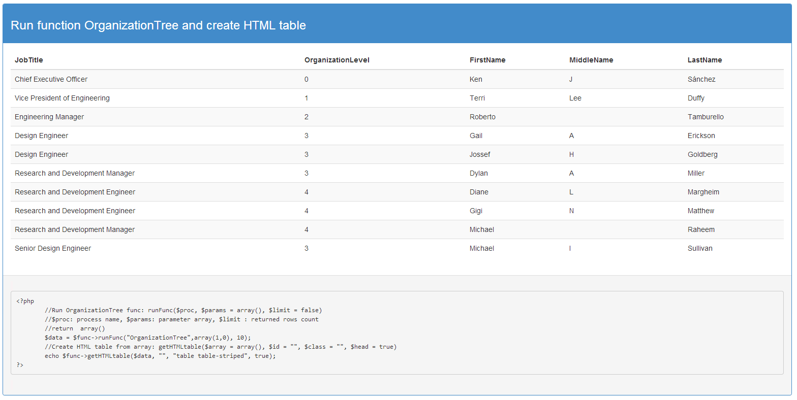

SqlFuncProc
===========

Useful tool for a fast development, when working more developers in one project. 

Demo: <a href="http://atandrastoth.co.uk/main/pages/phpclasses/SqlFuncProc/">Live Demo</a> 
 

usage: 
-create sql script with your favorite application 
-replace the parameters of the ? 
-save sql script to predefined folder 

<pre>
	require_once('SqlFuncProc.php');
	// get instance with PDO connection data
	//$func = SqlFuncProc::getInstance("mysql:host=YOURSERVER;dbname=AdventureWorks2012;charset=utf8", yourname, yourpass);
	$func = SqlFuncProc::getInstance("sqlsrv:Server=YOURSERVER;Database=AdventureWorks2012", null, null);
	// Functions list from folder with parameters : wievFunc($name = "", $class="")
	// $name: chars from filename, $class: table class
	echo $func->wievFunc("", "table table-bordered");
	// Processes list from folder with parameters : wievFunc($name = "", $class="")
	// $name: chars from filename, $class: table class
	echo $func->wievProc("", "table table-bordered");
	//Run noerror proc runProc($proc, $params = array(), $force = false);
	//$proc: process name, $params: parameter array
	$data = $func->runProc('noerror', array(50));
	print_r($data);
	//Run OrganizationTree func: runFunc($proc, $params = array(), $limit = false) 
	//$proc: process name, $params: parameter array, $limit : returned rows count
	//return  array()
  	$data = $func->runFunc("OrganizationTree",array(1,0), 10);
  	//Create HTML table from array: getHTMLtable($array = array(), $id = "", $class = "", $head = true) 
  	echo $func->getHTMLtable($data, "", "table table-striped", true);
</pre>

Add more feature in the nearest future...
 
Author: Tóth András

